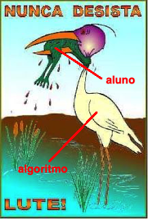
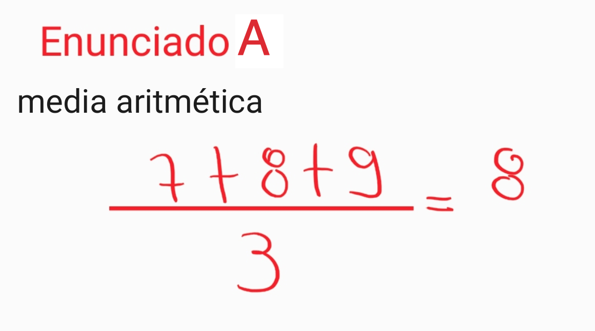
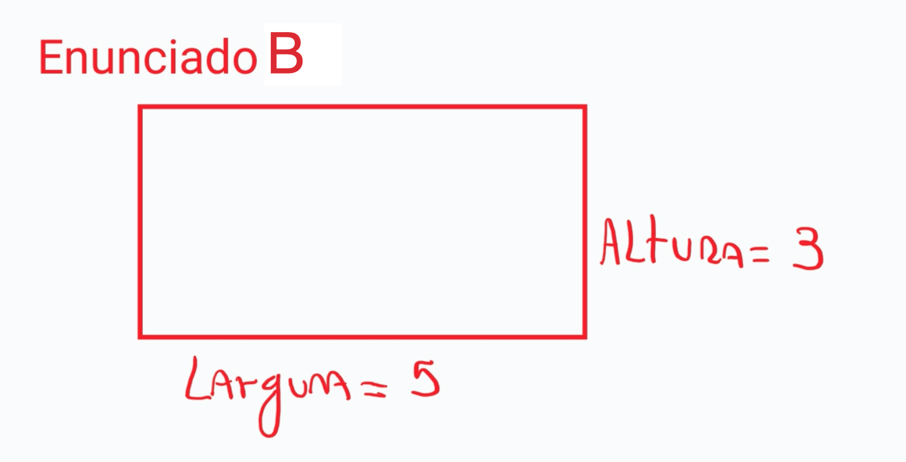

# Algumas anotações das aulas

## 

## Introdução à Programação - Unidade 1

## Aula: 01 e 02

- Avisos: os avisos serão feitos todos pelo Teams
- Apresentação do Professor
  
        Nome: Dalton Solano dos Reis
        1988-1992: Graduação na FURB (primeira turma de Computação)
        1994-1997: Mestrado (M.Sc.) na UFRGS .. Área Gráfica
        2003-2007: Doutorado (Dr.) na UFRGS .. Área Gráfica

- Leciono atualmente:

        1a fase - Introdução à Programação  
        2a fase - Introdução à Computação  
        2a fase - Lógica para Computação  
        7a fase - Computação Gráfica  
        8a fase - Realidade Virtual  
        8a fase - Desenvolvimento para Plataformas Móveis 
        8a fase - Trabalho de Conclusão de Curso I

- Linhas pesquisa:

        projetos relacionados com as disciplinas (área gráfica)  
        assuntos relacionados com a área da educação  

- Grupos de Pesquisa:  
        [<http://gcg.inf.furb.br/>](<http://gcg.inf.furb.br/> "grupo de pesquisa GCG")  
        [<http://tecedu.inf.furb.br/>](<http://tecedu.inf.furb.br/> "grupo de pesquisa TecEdu")  

- Zotero:
        [<https://www.zotero.org/daltonreis>](<https://www.zotero.org/daltonreis> "Zotero")  

- Oportunidade para fazer pesquisa: ser bolsista  

- Meu gosto tecnológico ..
  
        Curiosidade em como as coisas acontecem
        Brinquedinhos tecnológicos
        Novidades que facilitam o nosso dia-a-dia
        Área Gráfica: desde que comecei a trabalhar aos 14 anos com desenho técnico de projetos arquitetônicos

------

## Plano de Ensino

Ler com **muita ATENÇÃO**, e em caso de dúvida me questionem.

- Quantidade de créditos: 6 + 1 (atividades em casa)
- Sala de aula invertida
- Divisão das unidades e conteúdo de cada unidade
- Avaliações: prazos nas atividades no AVA3 dentro das unidades, e no cronograma
- Referências bibliográficas: algumas, usem o mostrado em aula .. cuidado para não perder o foco
  
## Conteúdo

### Apoio

- links gerais de toda a disciplina
  - cronograma: divisão das unidades, qual conteúdo, prazos de entrega
  - repositório: todo o conteúdo da disciplina e os exercícios das atividades práticas
  - horário da monitória

### Unidade 1

- link do Conteúdo
- atividade: questionário
- ambiente de desenvolvimento

## Ambiente de Desenvolvimento

- Java OpenJDK
- IDE (ambiente de desenvolvimento) VSCode

------

## Visão Geral do Conteúdo

- muitas palavras novas que serão explicadas mais para frente
- vai parecer algo muito abstrato

### Algoritmos

- problema: algo (as vezes imaginável) para ser resolvido
- desenvolvimento da ideia
- formalização da ideia
- codificação: linguagem de programação
- testes
- arrumar problemas encontrados
- testes
- usar ... 😉 ... e rezar para o usuário não aparecer com novos problemas, mas sim com novas necessidades

#### Algumas dicas

##### Desenvolvimento da ideia / Formalização da ideia

- praticar, praticar, ... praticar ..
- aprender com problemas já resolvidos
- resolveu, se der tempo, não poderia resolver da  melhor forma
- não desista, nunca, jamais ... desistiu, volte a insistir

    

- divisão e conquista ... subdividir em rotinas
- Etapas: Entrada / Processo / Saída

##### Codificação: linguagem de programação

- Exemplo, algo parecido com formalismo usado na Matemática (mas a computação é melhor 😉 )

  

  

  

  

  

  

- Exemplo, na Computação, uma representação gráfica:

    Fluxograma de uma rotina condicional simples

    Fluxograma de uma rotina para achar o menor valor entre três valores

## Como fica na prática

- irei demonstrar usando o nosso ambiente de desenvolvimento (Java+VSCode), mas não se preocupem ... hoje não iremos estudar este ambiente ... é só para demonstrar o processo de **Solução de Problemas**:
  - entender o problema​
  - verificar as entradas
  - identificar saídas
  - definir processos
  - descrever solução formalmente
  - testar

Também vamos assumir uma forma simples de entrar com os valores ..

ATENÇÃO: lembrem de irem instalando o "Ambiente de Desenvolvimento Prático" ..

------

### Exemplos de Enunciados

#### Enunciado A

As vezes o enunciado pode ter "gorduras" ...

    Era uma vez, uma pessoa que estava na praia. Esta pessoa conhecia um professor e este professor tinha um problema para resolver. O seu problema era que ele tinha que considerar uma situação que ele poderia ter 3 notas de um aluno e com elas poderia calcular a média deste aluno.

Ou ainda um enunciado "magrinho", mas as vezes se tem situações com falta de informações que não permitem solucionar o problema ... no caso, quantas notas para calcular a média?

    Considerando que um professor tem notas de um aluno, calcule média do aluno.

Uma aceitável e se ter uma descrição sucinta, mas que tenha todas as informações necessárias para poder resolver o problema.

    Um professor deseja calcular a média de um aluno. O professor tem o nome e as 3 notas do aluno e a média deve ser calculada de forma aritmética.​

Então vamos para primeira etapa:

- entender o problema​: Se pergunte, você consegue resolver este problema sem o uso do computador? Caso não consiga, bem provável é porque você não entendeu o enunciado ou falta informações, conhecimento, de como resolver o problema.

Uma forma de ajudar a entender o problema é extrair do enunciado:

- as entradas
- as saídas
- e definir os processos

**Então tente separar em:**

Desnecessário __

    Um professor deseja 
    O professor tem o nome

Não usado __

    nome

Entrada __
    // ter as 3 notas
    Nota1 = 7
    Nota2 = 8
    Nota3 = 9

Processo __
    // Calcular a média
    média = (nota1 + nota2 + nota3) / 3

Saída __
    // escrever a média
    escrever(média)

Bom, depois destas etapas vamos para:

- descrever solução formalmente

 .. vou mostrar como é no nosso ambiente

descrever solução formalmente __

    código em Java

E por fim, e muito importante

- testar: Para testar se precisa ter valores de **entrada**, e principalmente saber quais valores de **saída** serão gerados com estas **entradas**.

| Entrada       | Saída                                     |
| ---------- | --------------------------------------------- |
| Nota1 = 5.0, Nota2 = 7.0, Nota3 = 9.0 | Média = 7.0​ |
| Nota1 = 4.0, Nota2 = 6.0, Nota3 = 5.0 | Média = 5.0​ |
| Nota1 = 7.0, Nota2 = 5.0, Nota3 = 1.5 | Média = 4.5​ |

#### Enunciado B

Mais um problema a ser resolvido ...

    Modele a solução de um problema para calcular a área de uma sala retangular. 
    Considere que as medidas estão expressas em metros.

Então vamos para primeira etapa:

- entender o problema​: faça o cálculo na "mão". Use os valores de testes (abaixo) para verificar se seu calculo está certo.

**Então tente separar em:**

Desnecessário __

    Modele a solução de um problema para
    de uma sala 
    Considere que as medidas estão expressas em metros.

Não usado __

    metros

Entrada __
    /  ter a largura e altura
    largura = 3
    altura = 7

Processo __
    // calcular a área  retangular
    area = largura x altura

Saída __

    escrever(area)

descrever solução formalmente __

    código em Java

- testar

| Entrada       | Saída                                     |
| ---------- | --------------------------------------------- |
| largura = 10, comprimento = 10 | área = 100​ |
| largura =  5, comprimento =  7 | área =  35​ |
| largura =  3, comprimento = 90 | área = 270​ |
